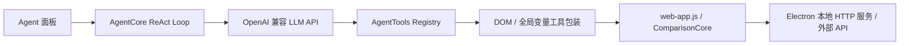
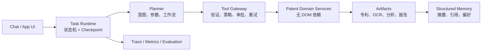

# PatentLens Agent 工程化优化实施计划

> 状态：待实施
>
> 架构基线：Electron（`electron-main.js` + `preload.js` + `src/web.html`）
>
> 适用范围：`src/scripts/agent/**`、Electron 主进程、本地 HTTP API 及其对应的 renderer 集成
> 目标读者：后续维护本仓库的 AI Coding Agent 与开发人员

---

## 1. 文档目的与执行边界

本计划将当前 PatentLens Agent 从“由大 Prompt 驱动、通过页面 DOM 模拟操作的聊天功能”，逐步升级为“可审计、可恢复、可控成本、可测试的专利工作流 Agent”。

本计划只面向当前有效的 Electron 架构。`src-tauri/` 是冻结历史代码，**不得**为实现本计划修改、同步或新增 Tauri 逻辑。架构约束以 [00-ACTIVE-ARCHITECTURE.md](00-ACTIVE-ARCHITECTURE.md) 和仓库根目录 `AGENTS.md` 为准。

本文是后续实施的执行依据。较早的 [08-PatentLens-Agent完整架构设计.md](08-PatentLens-Agent完整架构设计.md) 与 [09-Agent人机协作节点设计.md](09-Agent人机协作节点设计.md) 可作为产品意图参考，但其中 Tauri 前提、七层架构“已实现”暗示及未落地模块不得视为当前事实。

### 1.1 非目标

- 不在本计划的前两个阶段引入 LangChain、LangGraph 或多 Agent 框架。
- 不将任意文件系统、Shell 或 API Key 读写权限直接暴露给模型。
- 不通过增加 Prompt 规则来替代工具契约、审批机制、状态机或测试。
- 不将 PDF 标注清空、缓存删除、覆盖文件等破坏性操作默认自动化。

### 1.2 成功标准

1. Agent 的核心业务调用不再依赖 `document.querySelector(...).click()`、固定 `setTimeout` 或页面私有全局变量来判断完成。
2. 每一个有副作用或会产生费用的操作都有明确的能力等级、审批策略和可追溯记录。
3. OCR、AI 分析、报告导出等长任务具有 `jobId`，支持查询、取消、恢复和完成通知。
4. 每个结论可追溯到专利数据源、文档、页码/文本块和抓取时间。
5. 工具、工作流和关键的人机协作路径具备自动化测试与评测样本。

---

## 2. 当前实现盘点

### 2.1 当前运行链路



实际入口位于：

- `src/scripts/agent/agent.js`：初始化、对外聊天 API；新消息会中止当前任务。
- `src/scripts/agent/agent-loop.js`：单一 ReAct 循环，最大 40 次迭代。
- `src/scripts/agent/tool-registry.js`：工具注册与直接执行。
- `src/scripts/agent/llm-client.js`：OpenAI 兼容工具调用与流处理。
- `src/scripts/agent/ui/agent-panel.js`：聊天、进度、提问 UI。
- `src/scripts/agent/tools/*.js`：基础、专利、比对工具。

### 2.2 已注册工具（24 个）

| 分类 | 工具 |
|---|---|
| 对话控制 | `think`、`update_todos`、`finish`、`ask_user` |
| 专利全文 | `fetch_patent_fulltext`、`get_patent_claims`、`get_patent_abstract`、`get_patent_description`、`get_patent_family` |
| 审查档案 | `fetch_patent`、`get_patent_basic_info`、`get_timeline`、`get_documents_summary`、`get_family_summary`、`ocr_document`、`open_document_reader` |
| AI 审查分析 | `run_ai_analysis`、`get_analysis_result`、`fetch_dossier_and_analyze` |
| UI/外部链接 | `switch_to_tab`、`open_url` |
| 权利要求比对 | `prepare_claim_comparison`、`execute_claim_comparison`、`quick_compare_claims` |

### 2.3 当前逻辑上的“模式”

系统没有显式的 Mode/State 枚举。现有“模式”由系统提示词指挥模型临时判断：全文查询、审查档案、OCR、AI 审查梳理、权利要求比对、UI 导航和对话控制。这会导致模式切换不可测试、不可恢复，并且容易被模型遗漏。

### 2.4 已确认的工程问题

| 优先级 | 问题 | 证据/影响 |
|---|---|---|
| P0 | 核心工具依赖 DOM、全局变量、按钮点击和固定延时 | 页面结构或网络时序变化即可导致“工具成功但业务未完成”。 |
| P0 | `isBlocking`、`autoConfirm` 仅在 Registry 存储，执行器不解释 | 付费、下载、导出、打开 URL 没有统一审批策略。 |
| P0 | `ask_user` 的自由文本回复被 `isProcessing` 拦截 | 预设选项可点击，但用户按自然语言回复无法进入 callback。 |
| P0 | 会话与任务状态为全局内存 | 页面刷新、切换专利、新消息或未来并发任务会导致丢失/互相污染。 |
| P1 | AI 分析通过异步点击启动，没有可靠完成信号 | `get_analysis_result` 依赖 DOM 文本和正则推测状态。 |
| P1 | 无工具级参数验证、重试、超时、取消、幂等性和错误分类 | 模型参数错误和网络失败难以得到稳定处理。 |
| P1 | 上下文按消息数量截断，工具结果直接注入 LLM | OCR 原文和长 JSON 容易挤占上下文，且不可按来源检索。 |
| P1 | `finish` 会把所有 Todo 标成 completed | 无法反映失败、等待用户和后台运行等真实状态。 |
| P2 | 缺少 Agent 工具/工作流测试与评测 | 当前测试未覆盖工具契约、暂停恢复、审批、失败退避和端到端 Agent 路径。 |
| P2 | 旧架构文档与 Electron 现实存在偏差 | 后续 AI Coding 容易错误修改 Tauri 或按未实现模块做假设。 |

---

## 3. 尚未工具化的产品步骤

下表按优先级列出已有 GUI 能力或产品流程中尚未形成稳定 Agent 工具的部分。

| 优先级 | 当前步骤 | 缺口 | 建议工具/工作流 |
|---|---|---|---|
| P0 | 从审查文档中选出核心 OA/答复 | 只有文档摘要，选择策略由 LLM 临时文本推理 | `select_key_documents(policy, maxDocuments)` |
| P0 | 多文档 OCR | 只有单篇 `ocr_document` | `estimate_ocr_cost`、`start_ocr_job`、`get_job`、`cancel_job` |
| P0 | 指定文档的审查意见分析 | `run_ai_analysis` 通过 UI 自动全选，不能传文档集合与分析类型 | `analyze_documents(documentIds, analysisType)` |
| P0 | 长任务状态与完成通知 | 靠 DOM 文本猜测 | 所有异步工具返回 `jobId`，使用 job 事件或 `get_job` 查询 |
| P1 | 读取完整报告和来源 | 仅返回页面文本前 500 字 | `get_analysis_artifact`、`get_analysis_sources`、`locate_source` |
| P1 | Word/PDF/Excel 报告导出 | GUI 已有，Agent 没有安全工具 | `export_report(format, artifactId, destination)` |
| P1 | 合并导出审查文档 PDF | GUI 已有 | `merge_documents(documentIds, options)` |
| P1 | 文档下载、归档和产物管理 | GUI/浏览器下载，缺少结果对象 | `download_documents`、`list_artifacts`、`open_artifact` |
| P1 | 专利、PDF、选区翻译 | GUI 已有多种翻译入口 | `translate_patent_section`、`translate_document`、`translate_selection` |
| P1 | 阅读器内基于文档的 AI 问答 | GUI 已有 | `query_document`，结果必须带来源块。 |
| P1 | 引用/被引文献扩展分析 | 当前只能返回浅层列表 | `analyze_citations`、`fetch_related_patents` |
| P1 | 批量字段抽取和审核后 Excel 导出 | 产品已有提取模块 | `extract_fields`、`review_extraction`、`export_extraction_excel` |
| P2 | 项目、历史、偏好和恢复 | 没有会话外结构化记忆 | `create_project`、`list_projects`、`restore_task`、`set_preference` |
| P2 | 浏览器扩展/Espacenet 导入 | 最新产品能力未进入 Agent 工具面 | `import_external_patent_data` |

### 3.1 不应默认自动化的步骤

以下能力可在后续作为“审批工具”提供，但必须遵循最小权限和显式确认：

- 覆盖已有文件、清空 PDF 标注、删除历史/缓存。
- GLM 等按量计费 OCR 的批量调用。
- 打开任意外部 URL、批量下载文件、自动打开导出的本地文件。
- 读取、修改或展示 API Key、Token、代理配置。

---

## 4. 目标架构



### 4.1 Task Runtime：显式状态机

每个聊天请求创建一个 `taskId`；不能再以页面全局变量代表任务。

```text
planning
  -> running
  -> waiting_input       # 需要补充信息或做业务选择
  -> waiting_approval    # 有成本、外部副作用、不可逆操作
  -> waiting_job         # OCR/分析/导出等后台任务
  -> completed | failed | cancelled
```

每次状态变化均应写入 checkpoint，至少保存：`taskId`、用户目标、计划、工具调用、工具结果摘要、artifact 引用、待回答问题、审批内容和当前状态。Electron 重启后可显示并恢复可恢复的任务；不可恢复的远程调用必须明确标记。

### 4.2 Tool Gateway：唯一的工具执行入口

Tool Registry 不再直接 `tool.execute(args)`。它必须依次完成：

1. 用运行时 schema 校验和标准化参数。
2. 按工具能力评估策略、成本和审批需求。
3. 建立 `traceId`、`taskId`、幂等键和超时控制。
4. 执行时传入 `AbortSignal`。
5. 对可重试错误做有限指数退避；对认证、参数和配额错误不盲目重试。
6. 记录结构化结果、来源、产物和错误分类。

建议能力等级：

| 等级 | 含义 | 示例 | 默认策略 |
|---|---|---|---|
| `read` | 无副作用读取 | 查询专利、读取 artifact | 自动执行 |
| `compute` | 本地/远程计算，可能耗时 | OCR、分析、比对 | 小任务自动；批量/计费需策略检查 |
| `external_action` | 打开 URL、下载、调用第三方 | 浏览器、文件下载 | 默认确认或遵循用户偏好 |
| `write` | 创建报告、保存项目 | 导出 Word/PDF | 预览产物和目标后确认 |
| `destructive` | 删除、覆盖、清空 | 删除缓存、覆盖文件 | 每次明确确认 |

### 4.3 工具统一结果契约

所有工具必须返回统一结构，禁止仅返回任意字符串或仅靠 UI toast 表达结果。

```ts
type ToolResult<T> = {
  ok: boolean;
  status: "completed" | "queued" | "waiting_input" | "waiting_approval" | "failed" | "cancelled";
  data?: T;
  jobId?: string;
  artifactRefs?: ArtifactRef[];
  sources?: SourceRef[];
  error?: {
    code: "VALIDATION" | "AUTH" | "RATE_LIMIT" | "NETWORK" | "NOT_FOUND" | "UNSUPPORTED" | "INTERNAL";
    message: string;
    retryable: boolean;
  };
  nextAction?: {
    type: "ask_user" | "request_approval" | "wait_job" | "continue";
    payload?: unknown;
  };
};
```

`SourceRef` 至少包括：数据源、专利号、文档 ID、页码、文本块/坐标、抓取时间和原始链接。Agent 最终回答中的关键法律事实应从 `SourceRef` 生成用户可见引用。

### 4.4 领域服务：禁止 DOM 作为业务接口

建立可被 renderer、Agent 和 Electron 主进程共同调用的服务层。建议目录：

```text
src/scripts/agent/
  runtime/
    task-runtime.js
    task-store.js
    tool-gateway.js
    policy-engine.js
    job-manager.js
    artifact-store.js
  services/
    patent-service.js
    dossier-service.js
    document-service.js
    ocr-service.js
    analysis-service.js
    comparison-service.js
    report-service.js
  tools/
    ...按领域定义 schema 和 adapter
  workflows/
    dossier-analysis.js
    claim-comparison.js
```

服务层可通过 Electron preload bridge 或受控本地 HTTP API 调用主进程；renderer 只订阅状态与渲染结果。禁止新工具读取 `currentData`、`kanbanState`、`_prepState` 或模拟 `.click()`。

### 4.5 工作流优先，LLM 受约束

重复且高价值的流程应是确定性工作流：

- 审查意见分析：查询档案 → 文档分类/筛选 → 成本确认 → OCR job → 分析 job → 来源化报告 → 可选导出。
- 权利要求比对：解析专利号 → 获取权利要求 → 选择/确认锚点 → 比对 job → 报告 artifact。
- 专利全文问答：查询全文 → 创建专利 artifact → 按需取摘要/权利要求/说明书片段 → 生成带引用回答。

LLM 只负责意图识别、参数补全、选择合适工作流、请求用户选择和解释结果；不应直接驱动不可验证的 UI 副作用。

### 4.6 记忆、上下文和提示注入边界

- 将 OCR、全文、报告等大对象存为 artifact；LLM 上下文只传摘要和 artifact ID。
- 引入 token 预算与摘要压缩，不能只按“最近 30 条消息”截断。
- 外部专利页、OCR 文本、浏览器扩展导入内容均为不可信数据；必须以数据块形式传给模型，不能让其中的文本重写系统指令或工具策略。
- `think` 替换为面向用户的“行动说明/当前进度”，不要展示原始 reasoning content。
- 用户偏好（默认 OCR 引擎、导出格式、自动打开与否）应单独持久化，且可查看、修改、清除。

---

## 5. 分阶段开发计划

### 阶段 0：基线、契约和测试护栏

**目标**：在不大改产品行为的前提下，建立可安全重构的事实基线。

任务：

1. 新建工具清单，逐项标注输入、输出、能力等级、依赖的页面函数、是否有副作用、超时和测试状态。
2. 为现有 24 个工具建立 JSON Schema/运行时 validator；先以兼容模式报告错误，再逐步严格执行。
3. 新增 Agent 单元测试：Registry、参数校验、暂停/恢复、取消、错误分类、结果序列化。
4. 新增工作流 fixture：全文查询、审查档案、OCR 失败、GLM Key 缺失、用户拒绝批量 OCR、比对参数错误。
5. 标记并修复 `ask_user` 自由文本回答被 `isProcessing` 拦截的问题。
6. 在开发文档中明确 `docs/05-架构设计.md` 的 Tauri 内容为历史材料，避免后续实现误用。

验收：

- `npm test` 包含 Agent 测试，且关键状态转换有断言。
- 每个现有工具的输入与返回结构有可执行测试。
- 用户可点击选项或输入自由文本回复 `ask_user`，任务均能正确继续。

### 阶段 1：Task Runtime 与 Tool Gateway

**目标**：使一个任务具有身份、状态、日志、审批、取消和恢复能力。

任务：

1. 实现 `TaskRuntime`、`TaskStore`、`JobManager` 与 event schema。
2. 实现 `ToolGateway`：运行时校验、trace、超时、AbortSignal、有限重试、错误规范化。
3. 实现 `PolicyEngine`：基于能力等级、成本阈值、文件覆盖和用户偏好的审批规则。
4. 将 `ask_user`、`finish`、Todo 改为状态机事件，而不是未持久化 Promise 或强制“全部完成”。
5. 将 Agent UI 改为按 `taskId` 渲染，可以显示 waiting input/approval/job、取消和恢复。
6. 为已有工具加入 `taskId`、`traceId` 和统一 `ToolResult`，但保留旧调用 adapter 以降低一次性改动风险。

验收：

- 刷新或重启后能看到最近任务及其完成/失败/等待状态。
- 多个任务不会共享专利数据或比对预备状态。
- 取消能停止尚未开始的步骤，并向支持取消的请求传递 AbortSignal。
- 工具失败得到分类错误和有限重试记录，而不是无限 Prompt 重试。

### 阶段 2：领域服务化与主路径迁移

**目标**：消除核心 Agent 对 DOM 和固定延时的依赖。

按顺序迁移：

1. `PatentService`：全文查询、摘要、权利要求、说明书、同族、引用、法律事件。
2. `DossierService`：审查档案、文档列表、时间线和文档元数据。
3. `DocumentService` 与 `OcrService`：文档下载、单篇/批量 OCR、质量结果和 artifact 保存。
4. `AnalysisService`：指定文档集合、分析模板、后台 job、完整结果与来源索引。
5. `ComparisonService`：以数据对象而非 `ComparisonCore` 页面状态进行准备、锚点选择、运行和生成报告。
6. `ReportService`：Word/PDF/HTML/Excel 导出，统一 artifact 和文件审批。

迁移规则：

- 每次只迁移一个垂直切片；保持现有 UI 行为并为旧 UI 调用提供 adapter。
- 不在迁移阶段顺带重构 `src/scripts/web-app.js` 的无关模块。
- 删除 DOM 依赖前必须完成对应单元测试、Electron smoke test 和人工清单。

验收：

- 新工具不含 `document.querySelector`、`element.click()`、为等待业务完成而设的固定 `setTimeout`，也不读取 renderer 私有全局状态。
- 查询、OCR、分析、比对可在不打开相应 Tab 的情况下完成。
- UI 和 Agent 对同一个服务结果进行渲染/消费，不再各自实现一次业务逻辑。

### 阶段 3：高价值工具与人机协作完善

**目标**：将用户最常用的 GUI 工作流完整纳入 Agent，同时控制成本和风险。

任务：

1. 实现核心文档筛选规则：OA、答复、修正、授权通知、日期、轮次和最大数量；规则结果允许用户调整。
2. 实现批量 OCR 的成本/耗时预估；Paddle 默认可自动，小批量 GLM/大批量 OCR 必须审批。
3. 实现指定文档分析、分析深度/模板选择和分析完成通知。
4. 实现报告、合并 PDF、Excel 抽取、下载/归档、翻译、文档问答、引用分析等工具。
5. 为每一个报告结论和文档问答输出增加来源引用与“跳转原文”能力。
6. 实现用户偏好：OCR 引擎、导出格式、默认目录、是否自动打开文件；偏好可撤销。

验收：

- “分析某专利的审查意见并导出报告”全程最多需要两次明确确认。
- 对费用、批量规模、覆盖风险的确认 UI 中展示具体数量、估算和影响。
- 用户能从报告结论定位到专利/文档/页码/文本块。

### 阶段 4：可观测性、评测与受控扩展

**目标**：使 Agent 可持续优化，而不是仅依赖人工体验判断。

任务：

1. 记录结构化 trace：意图、计划、工具调用、耗时、重试、审批、失败原因、产物和用户反馈；日志中严禁存 API Key 和完整敏感文本。
2. 建立离线评测集，至少包含：全文查询、审查历程、同族、OCR、报告、比对、歧义澄清、失败恢复、拒绝副作用操作。
3. 对工具选择正确率、参数正确率、任务完成率、来源覆盖率、成本、延迟、用户中断率建立指标。
4. 在服务层稳定后，评估专用子 Agent：数据采集、OCR、专利分析、报告生成。每个子 Agent 必须使用独立上下文、最小工具集和相同 Gateway。
5. 评估 MCP 暴露方案；仅导出稳定、已鉴权、有 schema 和审计能力的领域工具。

验收：

- 每次失败均可由 `taskId`/`traceId` 回放到工具级原因。
- Prompt 或模型变更能够通过固定评测集比较回归。
- 子 Agent 不可绕过审批、策略、artifact 和追踪机制。

---

## 6. 首批工具规格

以下工具优先级最高，应在阶段 1 至阶段 3 逐一实现。

| 工具 | 能力 | 关键输入 | 关键输出 | 审批 |
|---|---|---|---|---|
| `select_key_documents` | read/compute | `patentRef`、策略、上限 | 推荐文档、理由、轮次、风险 | 否 |
| `estimate_ocr_cost` | read | 文档、引擎 | 页数、耗时、预计费用 | 否 |
| `start_ocr_job` | compute | 文档 ID 列表、引擎 | `jobId`、artifact refs | 超过策略阈值时 |
| `get_job` | read | `jobId` | 状态、进度、结果/错误 | 否 |
| `analyze_documents` | compute | OCR artifact、模板、分析范围 | `jobId` | 高成本/批量时 |
| `get_analysis_artifact` | read | artifact ID | 全文、结构化发现、引用 | 否 |
| `export_report` | write | artifact、格式、目标 | 文件 artifact、路径 | 文件策略/覆盖时 |
| `merge_documents` | write | 文档 ID、排序、封面 | PDF artifact | 是 |
| `translate_document` | compute | document/artifact、目标语言 | 翻译 artifact、引用映射 | 大批量/计费时 |
| `query_document` | read/compute | 文档 artifact、问题 | 回答、SourceRef[] | 否 |

---

## 7. 实施中的安全与质量约束

1. 所有参数校验必须发生在执行工具前，而不是仅写入 Prompt。
2. 不可信网页、OCR、导入文本仅作为数据；不得允许其内容定义工具名称、审批策略或系统指令。
3. 不在 renderer 中长期保存或向日志写入 API Key；密钥读取应最小化并通过安全桥/主进程控制。
4. 报告中的事实性结论必须带来源；模型无法从来源支持的内容须明确标为推断或未知。
5. 工具输出应使用 artifact 引用替代长文本直接进入 LLM 上下文。
6. 不用“模型说完成了”作为完成条件；完成以 job/服务状态和 artifact 可读取性为准。
7. 每个新工具至少包含：成功、参数错误、网络/服务失败、取消、权限/审批五类测试。
8. 修改 `web-app.js` 时遵循 `AGENTS.md` 的垂直切片和验证要求；不得将 Agent 改造与无关的大规模前端拆分混在同一提交。

---

## 8. 建议的首个实现 PR 切片

首个实施 PR 不应尝试完成全部改造。建议范围如下：

1. 新增 `runtime/task-runtime.js`、`runtime/tool-gateway.js` 和最小内存 `task-store.js`。
2. 将 `ask_user` 改为状态机 `waiting_input`，修复自由文本回复。
3. 为 `fetch_patent_fulltext` 建立第一条领域服务 adapter 与统一 `ToolResult`，不再依赖页面 Tab 是否已加载。
4. 添加这三条能力的单元测试和一个 Electron smoke 场景。
5. 保持其余工具可继续通过兼容 adapter 工作，避免大爆炸迁移。

首个 PR 的完成定义：一个全文专利查询任务可创建、执行、取消、结束；其结果具备 `taskId`、`traceId`、来源元数据和可显示状态；任务不因用户回复追问而卡死。

---

## 9. 后续 AI Coding Agent 工作清单

每次开始实现前：

1. 阅读根目录 `AGENTS.md` 和 [00-ACTIVE-ARCHITECTURE.md](00-ACTIVE-ARCHITECTURE.md)。
2. 确认本次改动只覆盖一个阶段中的一个垂直切片。
3. 检查当前工作区是否有用户未提交改动；不得覆盖无关改动。
4. 先写或更新该切片的测试与工具契约，再写实现。

每次结束前：

1. 运行相关单元测试，以及 `npm test`。
2. 影响 Electron 启动或主进程时，运行 `npm run test:electron-smoke`。
3. 手工验证相应 UI 路径，尤其是审批、取消、恢复和来源跳转。
4. 在 PR/提交描述中记录：迁移了哪个旧 DOM 依赖、增加了哪些工具契约、未覆盖的风险与下一步。

---

## 10. 最终决策

PatentLens 的下一阶段应优先建设 **Task Runtime + Tool Gateway + 无 DOM 的领域服务**。在这些基础设施稳定、可测试并具备审计能力前，不应优先开发多 Agent、自主递归规划或向外暴露 MCP。

这一路径能把现有丰富的专利 GUI 能力变成可靠的 Agent 工作流，同时保持 Electron 当前架构、产品 UI 和既有用户习惯的连续性。
